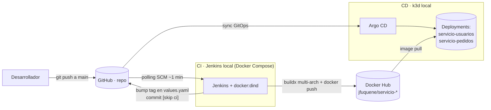

# Microservicios + CI/CD con GitOps — Diplomado DevOps

Dos microservicios en FastAPI con un flujo completo de **integración y despliegue continuos**:
Jenkins construye y publica las imágenes, versiona los charts de Helm en Git, y **Argo CD**
las despliega en un clúster Kubernetes local (k3d) siguiendo el patrón GitOps.

Todo el tooling (Jenkins y el clúster) corre en local sobre Docker.

---

## Arquitectura del flujo



1. Un push a `main` con cambios en `servicio-*/` o `Jenkinsfile` dispara el pipeline (Jenkins hace *polling*, no necesita webhook).
2. Jenkins construye las imágenes **multi-arquitectura** (`linux/amd64` + `linux/arm64`) y las sube a Docker Hub.
3. Jenkins reescribe el `image.tag` de los dos `helm-charts/*/values.yaml` y lo commitea a `main` con `[skip ci]`.
4. Argo CD detecta el commit, re-renderiza los charts y actualiza los Deployments en el clúster.

---

## Estructura del repositorio

```
.
├── servicio-usuarios/            # microservicio FastAPI — GET /db_usuarios/{id}  (uvicorn :8000)
├── servicio-pedidos/             # microservicio FastAPI — GET /pedidos           (uvicorn :8001)
├── helm-charts/                  # charts de despliegue (los consume Argo CD)
│   ├── servicio-usuarios-chart/
│   └── servicio-pedidos-chart/
├── Jenkinsfile                   # pipeline CI/CD declarativo (4 etapas)
├── jenkins/                      # Jenkins local con Docker Compose + Configuration as Code
│   ├── docker-compose.yml        #   servicios: jenkins + docker:dind
│   ├── Dockerfile                #   Jenkins LTS + Docker CLI/buildx + plugins + JCasC
│   ├── plugins.txt
│   ├── casc/jenkins.yaml         #   admin, credenciales, job y trigger de polling
│   ├── .env.example
│   └── README.md                 #   >>> detalle de la parte CI
└── k3d/                          # clúster Kubernetes local + Argo CD
    ├── k3d-config.yaml           #   1 server + 2 agents, Traefik en :8080/:8443
    ├── argocd/                   #   values de Argo CD + Applications (GitOps)
    ├── manifests/ingress.yaml    #   Ingress de Argo CD y de los 2 servicios
    ├── scripts/                  #   up.sh / down.sh / status.sh
    ├── Makefile
    └── README.md                 #   >>> detalle de la parte CD
```

---

## Los microservicios

| Servicio | Endpoint | Puerto | Imagen (Docker Hub) | Réplicas |
|---|---|---|---|---|
| servicio-usuarios | `GET /db_usuarios/{db_id}` | 8000 | `jfuquene/servicio-usuarios` | 2 |
| servicio-pedidos | `GET /pedidos` | 8001 | `jfuquene/servicio-pedidos` | 2 |

Ambos exponen además la doc de FastAPI en `/docs` y `/openapi.json`. No hay ruta `/` (devuelve 404, es normal).

### Ejecutar un servicio en local (sin Docker)

```bash
cd servicio-usuarios
pip install -r requirements.txt
uvicorn main:app --host 0.0.0.0 --port 8000
curl http://localhost:8000/db_usuarios/1
```

### Ejecutar con Docker

```bash
docker build -t servicio-usuarios ./servicio-usuarios
docker run --rm -p 8000:8000 servicio-usuarios
```

---

## Requisitos

| Para | Herramientas |
|---|---|
| CI (Jenkins) | Docker + Docker Compose v2 |
| CD (clúster) | [k3d](https://k3d.io) · kubectl · helm  (`brew install k3d kubectl helm`) |
| Desarrollo de los servicios | Python 3.10 |

---

## Puesta en marcha

### 1. CI — Jenkins

```bash
cd jenkins
cp .env.example .env          # edita: admin, DOCKERHUB_*, GITHUB_*
docker compose up -d --build  # 1er build ~2-4 min
```

- UI: `http://localhost:${JENKINS_HTTP_PORT}` (por defecto 8080; el `.env` de ejemplo usa **8090** para no chocar con k3d)
- Job `microservicios-pipeline` ya creado, con polling cada ~1 min

Detalle completo en **[jenkins/README.md](jenkins/README.md)**.

### 2. CD — clúster k3d + Argo CD

```bash
make -C k3d up        # crea el clúster, instala Argo CD y despliega los 2 servicios (~3-5 min)
make -C k3d status
make -C k3d password  # password de admin de Argo CD
```

Accesos (`*.localtest.me` resuelve a `127.0.0.1`):

| | URL |
|---|---|
| Argo CD | `http://argocd.localtest.me:8080` (usuario `admin`) |
| servicio-usuarios | `http://usuarios.localtest.me:8080/db_usuarios/1` |
| servicio-pedidos | `http://pedidos.localtest.me:8080/pedidos` |

Detalle completo en **[k3d/README.md](k3d/README.md)**.

### 3. Probar el flujo end-to-end

1. Haz un cambio en `servicio-usuarios/main.py` y push a `main`.
2. En ≤1 min Jenkins arranca el job (causa *"Started by an SCM change"*).
3. Al terminar, `helm-charts/*/values.yaml` tiene un `tag` nuevo commiteado por `Jenkins Pipeline`.
4. Argo CD sincroniza y hace rollout. Verifícalo:
   ```bash
   kubectl -n microservicios rollout status deploy/servicio-usuarios-chart--deployment
   curl http://usuarios.localtest.me:8080/db_usuarios/1
   ```

---

## El pipeline ([Jenkinsfile](Jenkinsfile))

| Etapa | Qué hace |
|---|---|
| **1. Checkout Code** | `checkout scm` y calcula `IMAGE_TAG = 1.0.<BUILD_NUMBER>-<short-sha>` |
| **2. Build and push Docker Images** | `docker login` → prepara `buildx` (QEMU + builder `docker-container` sobre el dind vía un `docker context`) → `docker buildx build --platform linux/amd64,linux/arm64 --push` para cada servicio |
| **3. Update Helm Chart Values** | `sed -i` reescribe la línea `tag:` de los dos `values.yaml` con el `IMAGE_TAG` |
| **4. Push Changes to GitHub** | commit de `helm-charts/` con `[skip ci]` en el mensaje y `git push HEAD:main` |

**Credenciales** (se crean por JCasC desde el `.env`, ver [jenkins/casc/jenkins.yaml](jenkins/casc/jenkins.yaml)):

- `dockerhub-team-credentials` → login y push a Docker Hub
- `github-credentials` → `git push` del bump de tags (Personal Access Token con permiso de escritura)

**Convención de tags**: `1.0.<n>-<sha>`, p. ej. `1.0.42-a1b2c3d` — monótono (por `BUILD_NUMBER`) y trazable al commit.

**Anti-bucle**: el commit de la etapa 4 solo toca `helm-charts/`; el polling está configurado para **ignorar esa ruta** (`excludedRegions('helm-charts/.*')`), así que no se re-dispara.

---

## Notas y limitaciones conocidas

- **Multi-arquitectura obligatoria**: los nodos de k3d en Apple Silicon corren `linux/arm64`; una imagen solo-`amd64` falla con `no match for platform in manifest`. Por eso la etapa 2 usa `buildx` multi-plataforma.
- **Puerto 8080**: lo usan tanto el LoadBalancer de k3d (Traefik) como Jenkins por defecto. El `.env` de ejemplo mueve Jenkins a `8090`.
- **Webhooks**: no se usan porque el Jenkins local no es alcanzable desde GitHub; el trigger es *polling SCM*.
- **Charts**: `values.yaml` define `pullPolicy` / `targertPort` pero los templates leen `imagePullPolicy` / `targetPort`; al renderizar quedan vacíos y Kubernetes aplica sus valores por defecto (`IfNotPresent`, `targetPort == port`). El despliegue funciona; es ruido cosmético.
- **`sed 's/tag: .*/.../'`** de la etapa 3 es codicioso: reescribe cualquier línea con `tag: `. Hoy solo existe la del `image.tag` en esos ficheros.
- El `repository:` de los charts **no** lo actualiza el pipeline (solo el `tag:`); cambiar de cuenta de Docker Hub es un ajuste manual en los dos `values.yaml`.

---

## Repositorio remoto

`https://github.com/Topejuanse/microservico-actividad-3-diplomado-devops` — rama `main`.
